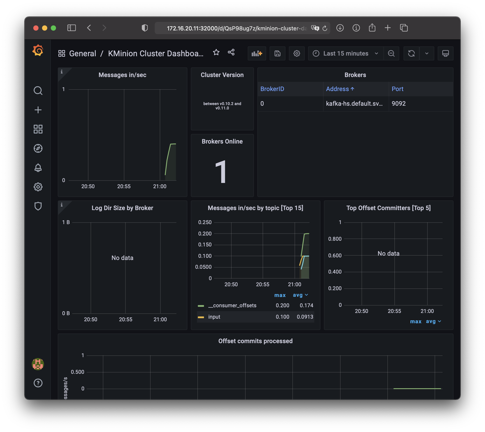
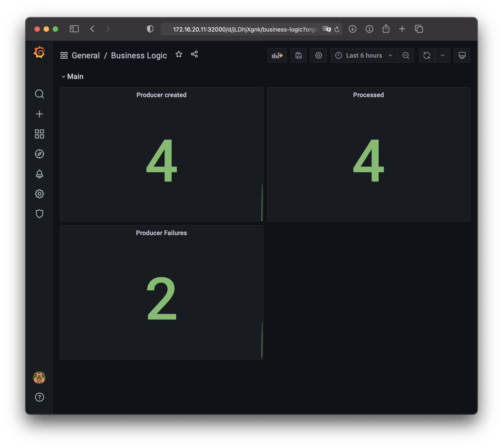
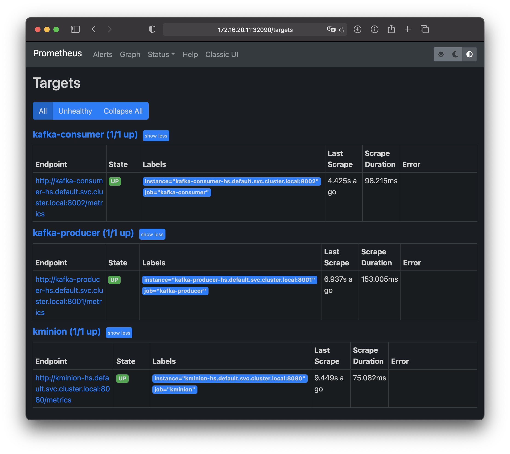

# Kubernetes cluster with Kafka

keywords: virtualbox vagrant ansible glusterfs kubernetes kubeadm kafka prometheus grafana kminion

## Quick Start

Install `virtualbox` and `vagrant` by method you preffer. There is an example at macOS by `brew` below.

```bash
brew install ansible vargant vagrant-manager virtualbox virtualbox-extension-pack
```

To run the solution execute next commands:

```bash
git clone https://github.com/urpylka/k8s-kafka.git
cd k8s-kafka
vagrant up
```

Most common command you can find below:

```bash
# Setup cluster & switch on the solution
vagrant up

# Switch off virtual machines
vagrant suspend

# Remove virtual machines (force)
vagrant destroy -f
```

After all machines setup it will take some time (usualy 5 mins) to pull and start all service to Kubernetes. You can check status by:

```bash
# Connect to master machine
vagrant ssh master

# Get common information about cluster
kubectl get all

# Check setup.log
cat /k8s/setup.log
```

PS Possible errors can be due to some components require other. It common situation just wait. It has hierarchy: `Zookeeper` -> `Kafka` -> `Consumer`. And another one important moment - check glusterfs cluster in `/k8s/setup.log`, because the process of creating this goes wo confirmation (other possible upgrades [here](#possible-upgrades)).

Normal state


After there are next interfaces from the host machine.

* [Grafana](http://172.16.20.11:32000) (http://172.16.20.11:32000)
* [Prometheus](http://172.16.20.11:32090) (http://172.16.20.11:32090)

You can open `Grafana` by default user/password (admin/admin). There will be available two dashboard:

* `Kminion` with information about Kafka broker
* `Business Logic` with metrics from `producer` & `consumer`. Theese metrics show how many messages will be produced and processed after.







## Next

### Something to change

To get more fun at the graphics you can delete & add `consumer` or `producer` node separately. Connect to the master. And execute one of the next command:

```bash
kubectl delete -f /k8s/71-producer.yaml
kubectl delete -f /k8s/72-consumer.yaml
kubectl apply -f /k8s/71-producer.yaml
kubectl apply -f /k8s/72-consumer.yaml
```

Also you can change message per second delay in `producer`. Last parametr in command section in `/k8s/71-producer.yaml`. By default it is 10 sec. You can set with another value.

### Docker images

`Producer` & `Consumer` are docker images. Their source code is placed in `/docker/`. For saving an updates you need to build, tag & upload it to [hub.docker.com](hub.docker.com). For that run `docker login` and then run `./build.sh` in the services directories. Now there is used my dockerhub account. It can be changed with yours (in `build.sh`, `71-producer.yaml`, `72-consumer.yaml`).

### Devnotes

Dev notes you can find [here](./devnotes.md).

## Possible upgrades

* Add the confirmation to process of creating the glusterfs cluster.
* Add `kafdrop` for looking topics and messages.
* Add `jmx-exporter` to Kafka image to get more metrics.
* Setup limits (cpu, mem) to more compitable machine.
* Add ability to connect to Kafka outside.

## Minimum system requirements

Tested on MacbookPro 13 2017

* Quad CPU at 2.3GHz
* 8GB memory
* 20GB disk

___
MIT License
Copyright (c) 2021 Artem Smirnov
